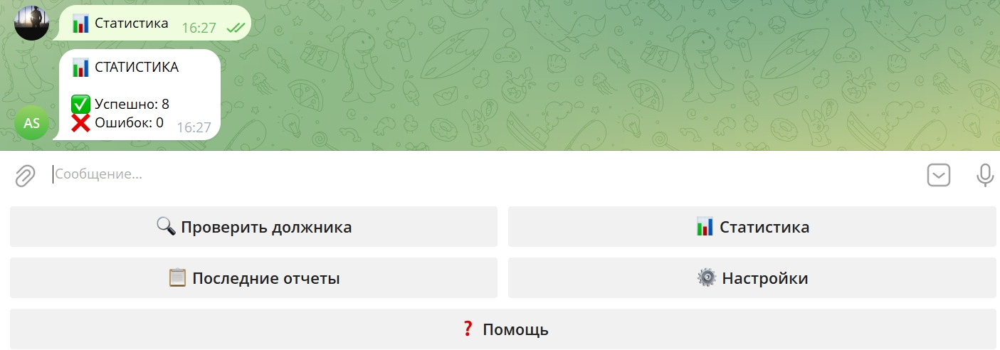

# 🤖 AI Collection System — Мультиагентная система взыскания долгов

## 📋 Описание
Автоматизированная система для проверки должников, анализа рисков и генерации рекомендаций по взысканию.

## 🎯 Возможности
- ✅ Проверка по ФССП, арбитражным судам, ЕГРЮЛ
- ✅ Анализ соответствия 230-ФЗ (коллекторы)
- ✅ Оценка риска банкротства и вероятности возврата
- ✅ Генерация скриптов для операторов
- ✅ Контроль 152-ФЗ (персональные данные)
- ✅ Telegram-бот для удобного доступа

## 🏗️ Архитектура (7 агентов)
| № | Агент | Функция |
|---|-------|---------|
| 1 | Data Collector | Сбор данных из источников |
| 2 | Compliance Checker | Проверка 230-ФЗ |
| 3 | Risk Analyzer | Оценка рисков должника |
| 4 | Strategy Advisor | Разработка стратегии взыскания |
| 5 | Script Generator | Генерация скриптов для операторов |
| 6 | Privacy Guardian | Контроль 152-ФЗ |
| 7 | Report Builder | Формирование отчетов |

## 🚀 Быстрый старт
Клонировать репозиторий: git clone https://github.com/yourusername/ai-collection-system
Установить зависимости: pip install -r requirements.txt
Запустить оркестратор: python orchestrator_v2.py
Запустить бота: python telegram_bot.py

## 📸 Демонстрация

### Главное меню

### Отчёт по должнику

### Статистика

### GitHub репозиторий

## 👤 Автор
[Сергей Антоненко]
- AI-архитектор (мультиагентные системы)

## 📞 Контакты
- Telegram: @nspoli
- Email: snantonenko17@gmail.com

## ⚖️ Лицензия
MIT License
